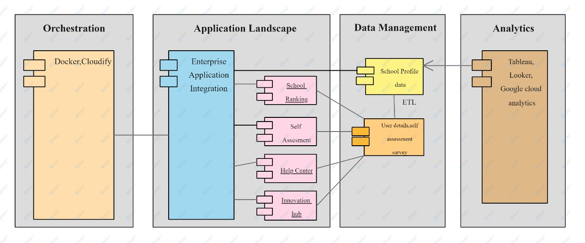
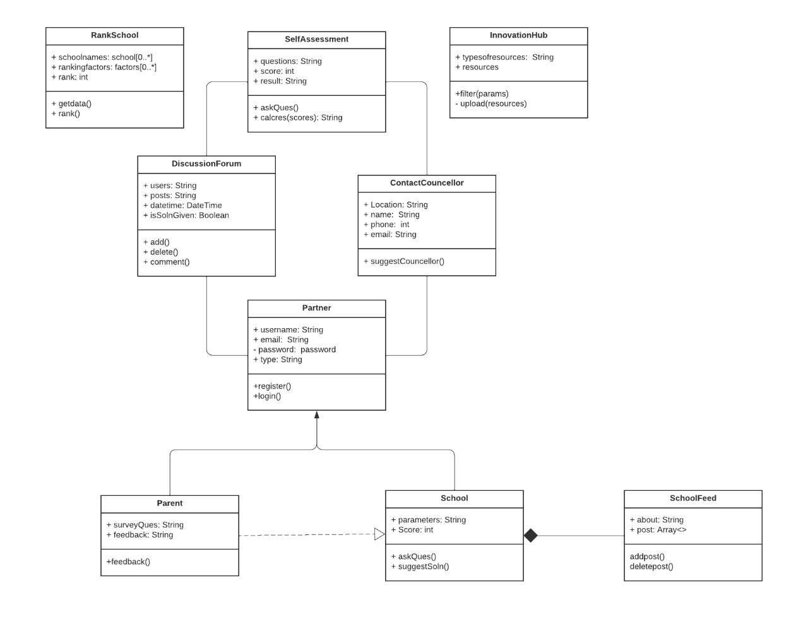
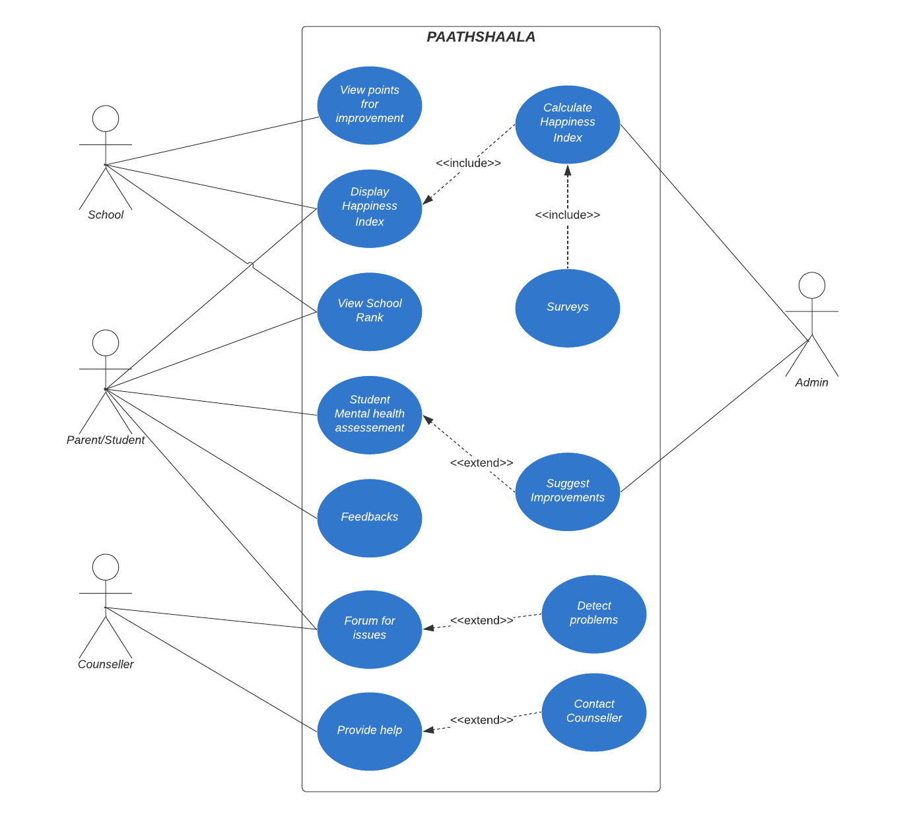
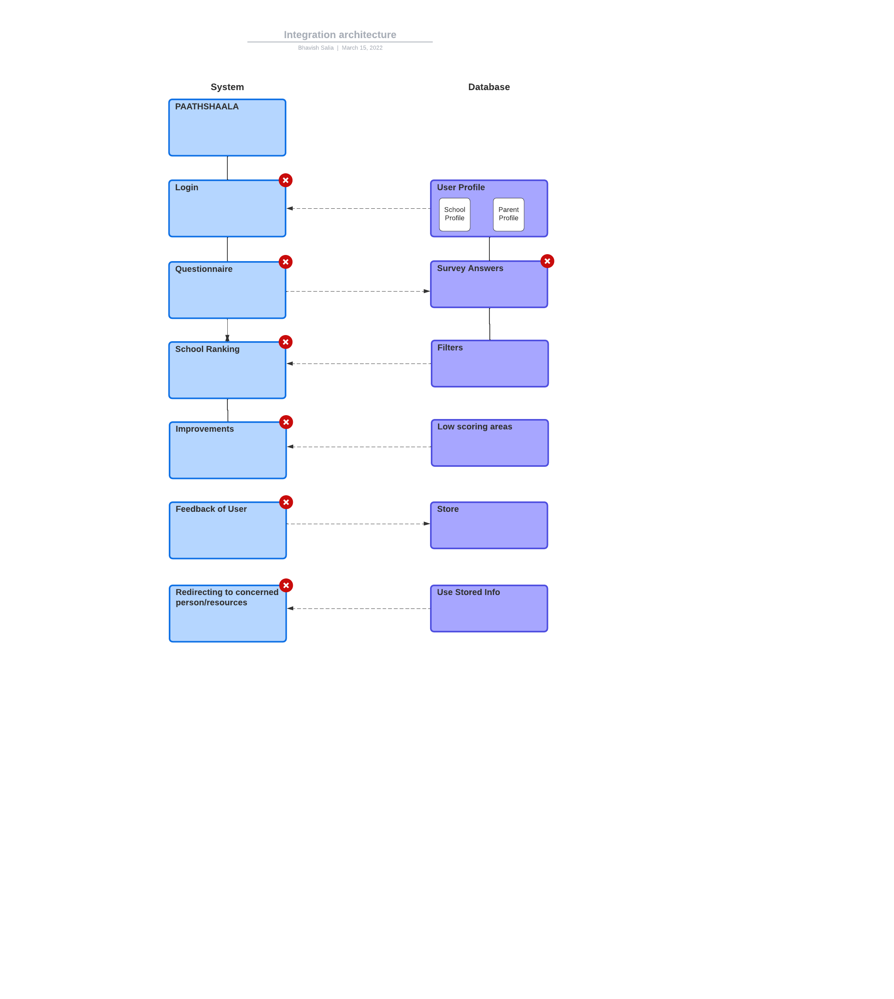
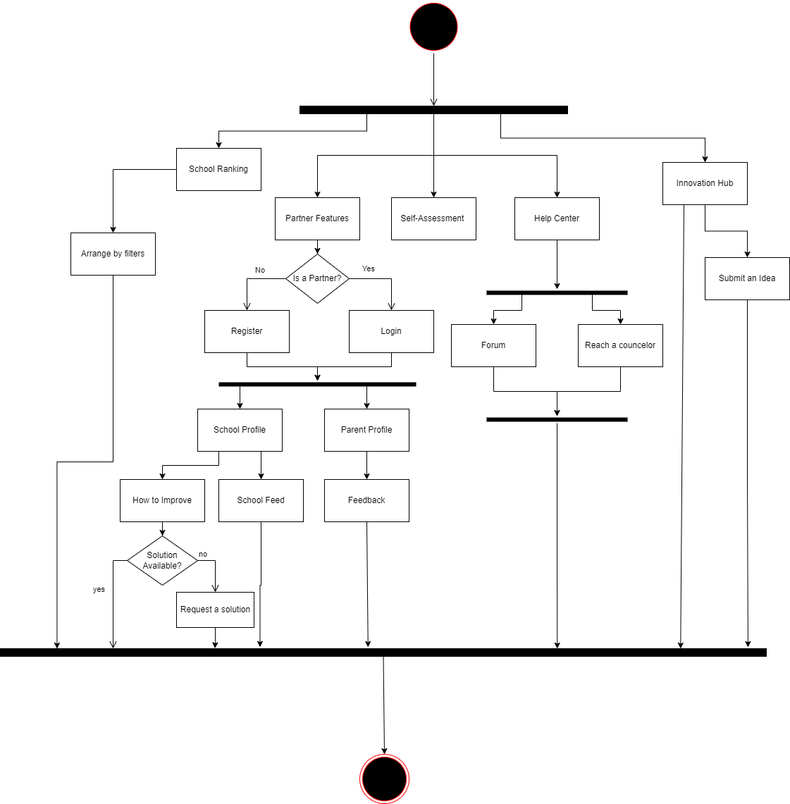

<h1 align="center">PAATHSHAALA</h1>
<div align="center">
  
  <h2> Platform for Assessing and Advancing The Happiness Index of Schools And Assisting Learner's Ambitions </h2>
  <h3 align="center"><b> Paathshaala is an application which enables schools to monitor their student's happiness index to make sure the mental well being of school going children in India. It also provides solutions and suggestions based on student and parent feedback. An individual can also assess their mental health by using our self-assessment form and we will provide them with the results and resources to better manage their health. </b></h3>

</div>

<div align="center">
  
[](https://www.djangoproject.com/ "Django")
[](https://www.sqlite.org/index.html "SQLite")

</div>

- ### Snapshots of the project :

<div align="center">
  





  
</div>


---

### Features:
- School Ranking and happiness index
- Points for improvement
- Anonymous discussion forum
- Surveys and feedback
- Self assessment
- Feed for tracking school activities
- Demographic weightage
- Help center
- School dashboard

### Tech Stack:
- Django
- LDA
- Plotly
- HTML
- CSS
- Bootstrap
- JavaScript
- JQuery
- SQL
- SMTP
- Ajax
- Cloudinary

### Feasibility and Deployability:
The Solution is lightweight as it occupies only 466Mb of space and the database that we used integrates data from different sources and distributions creating one simple repo for easily accessing, manupulating and analysing the data to improve our application and save more lives.

### Novelty of method and Implementation
The metric that we used for estimating the happiness index is as follows.

### Future work:
- Provide solutions for special-aided students.
- Inculcate myriad other features like social skills, participation, attentiveness in class to calculate the happiness index and what reforms can be undertaken to ensure that teachers and students are in a positive and evolving environment.
- This project can be extended beyond schools to colleges and workplaces as happiness index and mental health is an evergrowing concern in these times.
- Anomaly detection for special circumstances of students and schools.
  
### To run this project :

Clone the project -
```
  $ git clone https://github.com/MindMantraSIH/paathshaala.git
```
  
Install all the requirements -
```
  $ pip install -r requirements.txt
 ``` 
Run the following commands -

 for linux/mac :
``` 
  $ python manage.py migrate
  $ python manage.py makemigrations
``` 
 for windows :
 ``` 
  $ python manage.py migrate
  $ python manage.py makemigrations
 ``` 
Start the project -
 - ### Run the Web Application -
 for linux/mac :
```
  $ python manage.py runserver
```  
 for windows :
``` 
  $ python manage.py runserver
```
 
 ### If you want to clone the web application -
 
 - Link to the web application repository  <a href="https://github.com/MindMantraSIH/paathshaala.git">:link:</a>

  

---
- #### If you have any improvements create an issue and if you want you can also make a pull request for the same 

---


---
<h3 align="center"><b>Developed with :heart: by <a href="https://github.com/MindMantraSIH">TEAM MINDMANTRA</a>.</b></h1>
